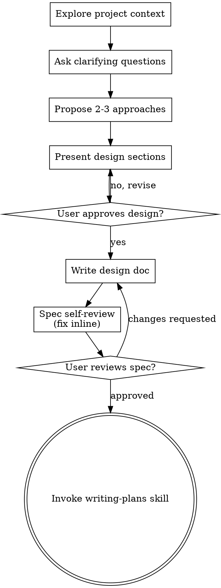

# Brainstorming Ideas Into Designs

Help turn ideas into fully formed designs and specs through natural collaborative dialogue.

Start by understanding the current project context, then ask questions one at a time to refine the idea. Once you understand what you're building, present the design and get user approval.

<HARD-GATE>
Do NOT invoke any implementation skill, write any code, scaffold any project, or take any implementation action until you have presented a design and the user has approved it. This applies to EVERY project regardless of perceived simplicity.
</HARD-GATE>

## Anti-Pattern: "This Is Too Simple To Need A Design"

Every project goes through this process. A todo list, a single-function utility, a config change — all of them. "Simple" projects are where unexamined assumptions cause the most wasted work. The design can be short (a few sentences for truly simple projects), but you MUST present it and get approval.

## Checklist

Follow these steps in order. Use `todo_write` to plan the steps, then sign each off with `complete_step` (it requires evidence — the command you ran, the file you wrote, or the ask result; empty evidence is rejected). Create the todo list **only when you are about to enter a multi-turn exploration/design loop**, not at the very start of the conversation. Each step that requires user input (steps 2, 3, 4, 7) is a natural turn boundary — `complete_step` the current step with evidence, then respond to the user; do NOT leave todo items perpetually in_progress across turns.

1. **Explore project context** — check files, docs, recent commits (use `read_file`, `grep`, `bash` for git log). `complete_step` with the commands/files as evidence.
2. **Ask clarifying questions** — one at a time, understand purpose/constraints/success criteria. **Use the `ask` tool** for any question with a finite set of answers (pick one of N options); only use an open-ended prose question when no structured form fits. `complete_step` with the ask tool's returned choice (or your open question text) as evidence, so the user can respond.
3. **Propose 2-3 approaches** — with trade-offs and your recommendation. **Use the `ask` tool** to let the user pick. `complete_step` with the chosen approach as evidence.
4. **Present design** — in sections scaled to their complexity. **Use the `ask` tool** to get approval after each section (options like "approve / revise section X / revise whole design"). `complete_step` once the full design is approved.
5. **Write design doc** — save to `docs/specs/YYYY-MM-DD-<topic>-design.md` and commit. `complete_step` with the written file path as evidence.
6. **Spec self-review** — quick inline check for placeholders, contradictions, ambiguity, scope (see below). `complete_step` noting what you checked/fixed.
7. **User reviews written spec** — **use the `ask` tool** to request spec review (options: "approved / changes requested"), referencing the spec path. `complete_step` with the user's decision as evidence.
8. **Transition to implementation** — invoke writing-plans skill via `run_skill({name: "writing-plans"})`. `complete_step` confirming the handoff.

## Process Flow

**The terminal state is invoking writing-plans.** Do NOT invoke any other implementation skill directly. The ONLY skill you invoke after brainstorming is writing-plans.

## The Process

**Understanding the idea:**

- Check out the current project state first (files, docs, recent commits) using `read_file`, `grep`, and `bash` (git log)
- Before asking detailed questions, assess scope: if the request describes multiple independent subsystems (e.g., "build a platform with chat, file storage, billing, and analytics"), flag this immediately. Don't spend questions refining details of a project that needs to be decomposed first.
- If the project is too large for a single spec, help the user decompose into sub-projects: what are the independent pieces, how do they relate, what order should they be built? Then brainstorm the first sub-project through the normal design flow. Each sub-project gets its own spec → plan → implementation cycle.
- For appropriately-scoped projects, ask questions one at a time to refine the idea
- Prefer the `ask` tool (multiple-choice) when possible, but open-ended is fine too
- Only one question per message — if a topic needs more exploration, break it into multiple questions
- Focus on understanding: purpose, constraints, success criteria

**Exploring approaches:**

- Propose 2-3 different approaches with trade-offs
- Present options conversationally with your recommendation and reasoning
- Use the `ask` tool to let the user pick between approaches
- Lead with your recommended option and explain why

**Presenting the design:**

- Once you believe you understand what you're building, present the design
- Scale each section to its complexity: a few sentences if straightforward, up to 200-300 words if nuanced
- Ask after each section whether it looks right so far
- Cover: architecture, components, data flow, error handling, testing
- Be ready to go back and clarify if something doesn't make sense

**Design for isolation and clarity:**

- Break the system into smaller units that each have one clear purpose, communicate through well-defined interfaces, and can be understood and tested independently
- For each unit, you should be able to answer: what does it do, how do you use it, and what does it depend on?
- Can someone understand what a unit does without reading its internals? Can you change the internals without breaking consumers? If not, the boundaries need work.
- Smaller, well-bounded units are also easier for you to work with — you reason better about code you can hold in context at once, and your edits are more reliable when files are focused. When a file grows large, that's often a signal that it's doing too much.

**Working in existing codebases:**

- Explore the current structure before proposing changes. Follow existing patterns.
- Where existing code has problems that affect the work (e.g., a file that's grown too large, unclear boundaries, tangled responsibilities), include targeted improvements as part of the design — the way a good developer improves code they're working in.
- Don't propose unrelated refactoring. Stay focused on what serves the current goal.

## After the Design

**Documentation:**

- Write the validated design (spec) to `docs/specs/YYYY-MM-DD-<topic>-design.md`
  - (User preferences for spec location override this default)
- Commit the design document to git

**Spec Self-Review:**
After writing the spec document, look at it with fresh eyes:

1. **Placeholder scan:** Any "TBD", "TODO", incomplete sections, or vague requirements? Fix them.
2. **Internal consistency:** Do any sections contradict each other? Does the architecture match the feature descriptions?
3. **Scope check:** Is this focused enough for a single implementation plan, or does it need decomposition?
4. **Ambiguity check:** Could any requirement be interpreted two different ways? If so, pick one and make it explicit.

Fix any issues inline. No need to re-review — just fix and move on.

**Optional: Spec Document Review Subagent**

For complex specs, you can dispatch a spec reviewer subagent to verify completeness:

Use the `task` tool with the spec-reviewer prompt template (see Reference: spec-document-reviewer-prompt below). Fill in the `prompt` parameter with the complete template, replacing `[SPEC_FILE_PATH]` with the actual path.

**User Review Gate:**
After the spec review loop passes, use the `ask` tool to request spec review — do NOT just ask in prose. Frame it as a structured choice:

> `ask`: header "Spec review" — question "Spec written and committed to `<path>`. Review it and let me know if you want changes before I write the implementation plan." — options: "Approved — proceed to plan", "Changes requested" (put approved first as the recommended option)

If the user picks "Changes requested", make the changes and re-run the spec review loop. Only proceed once the user approves.

**Implementation:**

- Invoke the writing-plans skill via `run_skill({name: "writing-plans"})`
- Do NOT invoke any other skill. writing-plans is the next step.

## Key Principles

- **One question at a time** — Don't overwhelm with multiple questions
- **Multiple choice preferred** (via `ask` tool) — Easier to answer than open-ended when possible
- **YAGNI ruthlessly** — Remove unnecessary features from all designs
- **Explore alternatives** — Always propose 2-3 approaches before settling
- **Incremental validation** — Present design, get approval before moving on
- **Be flexible** — Go back and clarify when something doesn't make sense

## Visual Presentation (Reasonix)

Reasonix does not have a browser-based visual companion. When visual questions arise (layouts, diagrams, architecture):

- **Use ASCII/text diagrams** in your reply for architecture flows and relationships
- **Use the `ask` tool** for structured A/B/C/D choices between approaches
- **Describe visual concepts in words** — "single column layout with a sidebar on the left" is sufficient for most design discussions
- **For complex diagrams**, write them as graphviz `dot` blocks in your reply — they render in some terminals and are readable as text
