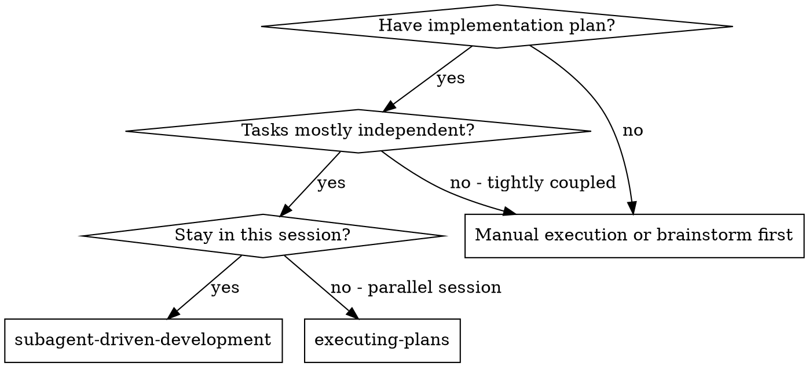
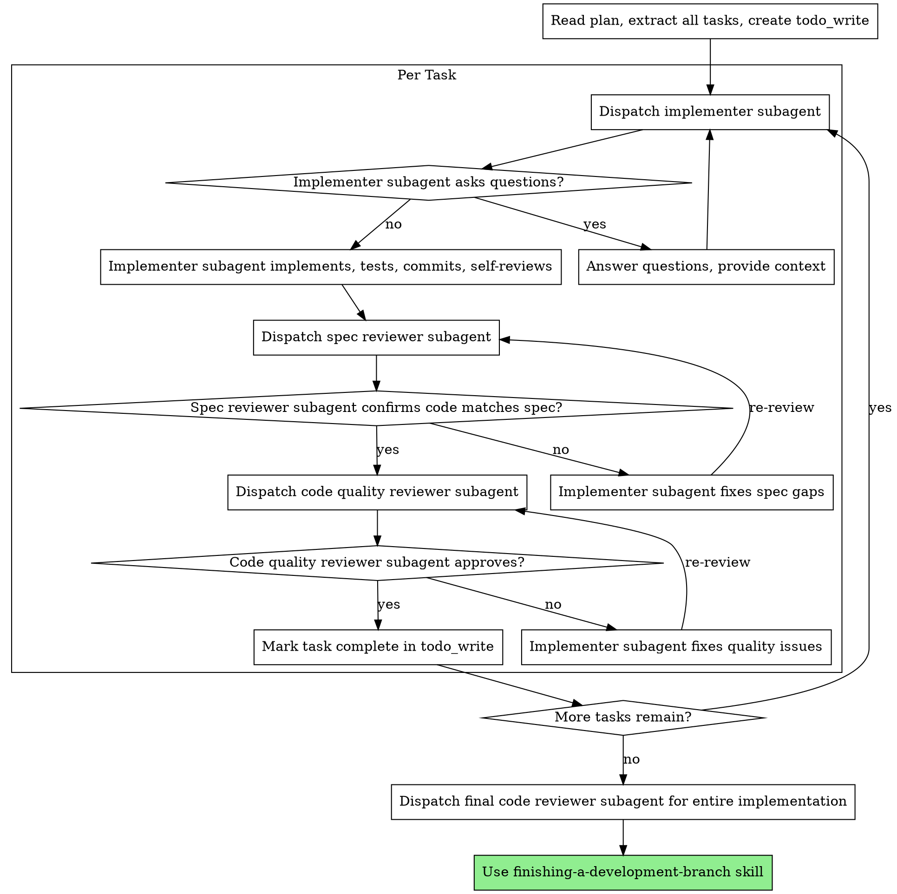

# Subagent-Driven Development

Execute plan by dispatching fresh subagent per task, with two-stage review after each: spec compliance review first, then code quality review.

**Why subagents:** You delegate tasks to specialized agents with isolated context. By precisely crafting their instructions and context, you ensure they stay focused and succeed at their task. They should never inherit your session's context or history — you construct exactly what they need. This also preserves your own context for coordination work.

**Core principle:** Fresh subagent per task + two-stage review (spec then quality) = high quality, fast iteration

**Continuous execution:** Do not pause to check in with your human partner between tasks. Execute all tasks from the plan without stopping. The only reasons to stop are: BLOCKED status you cannot resolve, ambiguity that genuinely prevents progress, or all tasks complete. "Should I continue?" prompts and progress summaries waste their time — they asked you to execute the plan, so execute the plan.

## When to Use



**vs. Executing Plans (parallel session):**
- Same session (no context switch)
- Fresh subagent per task (no context pollution)
- Two-stage review after each task: spec compliance first, then code quality
- Faster iteration (no human-in-loop between tasks)

## The Process



## How to Dispatch Subagents in Reasonix

Use the `task` tool for each subagent dispatch. The prompt templates are in the Reference sections below — fill ALL placeholders before dispatching.

**Implementer dispatch:**
```
task tool:
  description: "Implement Task N: [task name]"
  prompt: [Fill implementer-prompt template — see Reference: implementer-prompt]
  tools: ["read_file", "write_file", "edit_file", "bash", "grep", "glob"]  (adjust per task)
```

**Spec reviewer dispatch:**
```
task tool:
  description: "Review spec compliance for Task N"
  prompt: [Fill spec-reviewer-prompt template — see Reference: spec-reviewer-prompt]
  tools: ["read_file", "grep", "bash"]  (read-only)
```

**Code quality reviewer dispatch:**
```
task tool:
  description: "Review code quality for Task N"
  prompt: [Fill code-quality-reviewer-prompt template — see Reference: code-quality-reviewer-prompt]
  tools: ["read_file", "grep", "bash"]  (read-only)
```

**Iterative fix loops (Reasonix advantage):** When a reviewer finds issues and the implementer needs to fix them, you can use `continue_from` with the implementer's subagent reference (`sa_...`) to resume the same session with full context retained. This is more efficient than starting fresh.

## todo_write and Multi-Turn Safety

When using `todo_write` to track plan tasks during execution, follow these rules to avoid blocking Reasonix's readiness check:

- **Create the todo list once** when you start executing the plan (one item per plan task).
- **Mark a task in_progress** right before you dispatch the implementer subagent for it.
- **Mark it completed** right after the code quality reviewer approves — before doing anything else.
- **Never end your turn with a task still in_progress.** If you need to pause between tasks, mark the current task completed (or remove it) and end cleanly.
- If a subagent reports BLOCKED and you need to ask the user for guidance, mark the task completed first, then ask.

## Model Selection

Use the least powerful model that can handle each role to conserve cost and increase speed. Pass via the `model` parameter on the `task` tool.

**Mechanical implementation tasks** (isolated functions, clear specs, 1-2 files): use a fast, cheap model. Most implementation tasks are mechanical when the plan is well-specified.

**Integration and judgment tasks** (multi-file coordination, pattern matching, debugging): use a standard model.

**Architecture, design, and review tasks**: use the most capable available model.

**Task complexity signals:**
- Touches 1-2 files with a complete spec → cheap model
- Touches multiple files with integration concerns → standard model
- Requires design judgment or broad codebase understanding → most capable model

## Handling Implementer Status

Implementer subagents report one of four statuses. Handle each appropriately:

**DONE:** Proceed to spec compliance review.

**DONE_WITH_CONCERNS:** The implementer completed the work but flagged doubts. Read the concerns before proceeding. If the concerns are about correctness or scope, address them before review. If they're observations (e.g., "this file is getting large"), note them and proceed to review.

**NEEDS_CONTEXT:** The implementer needs information that wasn't provided. Provide the missing context and re-dispatch.

**BLOCKED:** The implementer cannot complete the task. Assess the blocker:
1. If it's a context problem, provide more context and re-dispatch with the same model
2. If the task requires more reasoning, re-dispatch with a more capable model
3. If the task is too large, break it into smaller pieces
4. If the plan itself is wrong, escalate to the human

**Never** ignore an escalation or force the same model to retry without changes. If the implementer said it's stuck, something needs to change.

## Red Flags

**Never:**
- Start implementation on main/master branch without explicit user consent
- Skip reviews (spec compliance OR code quality)
- Proceed with unfixed issues
- Dispatch multiple implementation subagents in parallel (conflicts)
- Make subagent read plan file (provide full text instead)
- Skip scene-setting context (subagent needs to understand where task fits)
- Ignore subagent questions (answer before letting them proceed)
- Accept "close enough" on spec compliance (spec reviewer found issues = not done)
- Skip review loops (reviewer found issues = implementer fixes = review again)
- Let implementer self-review replace actual review (both are needed)
- **Start code quality review before spec compliance is ✅** (wrong order)
- Move to next task while either review has open issues

**If subagent asks questions:**
- Answer clearly and completely
- Provide additional context if needed
- Don't rush them into implementation

**If reviewer finds issues:**
- Implementer (same subagent via `continue_from`) fixes them
- Reviewer reviews again (new `task` dispatch)
- Repeat until approved
- Don't skip the re-review

**If subagent fails task:**
- Dispatch fix subagent with specific instructions
- Don't try to fix manually (context pollution)

## Integration

**Required workflow skills:**
- **using-git-worktrees** — Ensures isolated workspace (creates one or verifies existing). Invoke via `run_skill({name: "using-git-worktrees"})`
- **writing-plans** — Creates the plan this skill executes. Invoke via `run_skill({name: "writing-plans"})`
- **requesting-code-review** — Code review template for reviewer subagents. Invoke via `run_skill({name: "requesting-code-review"})`
- **finishing-a-development-branch** — Complete development after all tasks. Invoke via `run_skill({name: "finishing-a-development-branch"})`

**Subagents should use:**
- **test-driven-development** — Subagents follow TDD for each task

**Alternative workflow:**
- **executing-plans** — Use for parallel session instead of same-session execution. Invoke via `run_skill({name: "executing-plans"})`
